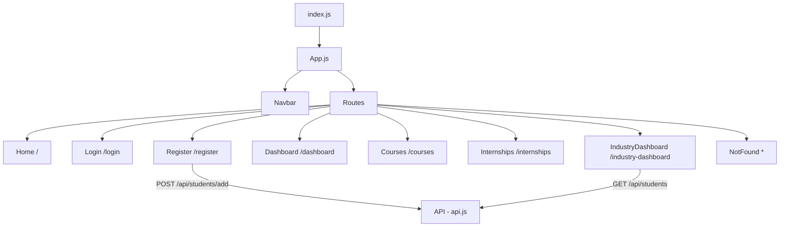

# Design Document — Prashikshan Frontend

## Overview

The Prashikshan frontend is a React SPA (Single Page Application) that serves two user roles: Students and Industry partners. It uses React Router v7 for client-side routing, a shared `api.js` Axios instance for backend communication, and plain CSS for styling (consistent with the existing Login.css approach — no external UI library needed).

The app has 7 routes, a shared Navbar component, and a lightweight context for passing student profile data between the registration and dashboard pages.

---

## Architecture



State is kept local to each page component. A `StudentContext` is used to pass the newly registered student's data from the Register page to the Dashboard without requiring a full auth system.

---

## Components and Interfaces

### Shared Components

**Navbar** (`src/components/Navbar.js`)
- Renders on every page via `App.js`
- Shows: "Prashikshan" brand link → `/`
- Shows: Login link when no student is in context
- Shows: Dashboard, Courses, Internships links when a student is in context
- Shows: Industry Dashboard link when industry role is active

### Pages

| Page | Path | Description |
|---|---|---|
| `Home` | `/` | Landing page with platform intro and CTA to login/register |
| `Login` | `/login` | Role-based login form; routes to correct dashboard |
| `Register` | `/register` | Student onboarding form; POSTs to backend |
| `Dashboard` | `/dashboard` | Student dashboard with welcome + nav cards |
| `Courses` | `/courses` | Static list of course cards |
| `Internships` | `/internships` | Static list of internship cards |
| `IndustryDashboard` | `/industry-dashboard` | Fetches and lists all students from API |
| `NotFound` | `*` | 404 fallback page |

### Context

**StudentContext** (`src/context/StudentContext.js`)
- Provides: `student` (object), `setStudent` (function)
- Used by: `Register` (sets student on success), `Dashboard` (reads student name/level), `Navbar` (conditionally shows links)

---

## Data Models

### Student (matches backend schema)

```js
{
  name: String,        // required
  email: String,       // required
  skills: [String],    // required — entered as comma-separated, split before POST
  interests: [String], // required — entered as comma-separated, split before POST
  level: String        // "beginner" | "intermediate" | "advanced"
}
```

### Course (static, frontend-only)

```js
{
  id: Number,
  title: String,
  description: String,
  level: String   // "beginner" | "intermediate" | "advanced"
}
```

### Internship (static, frontend-only)

```js
{
  id: Number,
  company: String,
  role: String,
  skills: [String]
}
```

---

## Error Handling

| Scenario | Handling |
|---|---|
| Register form — empty required field | Inline validation message below the field before submit |
| Register form — API error | Error banner displayed above the form |
| Login form — empty email or password | Inline validation message |
| Industry Dashboard — API fetch error | Error message rendered in place of the student list |
| Industry Dashboard — loading state | "Loading..." text shown while fetch is in progress |
| Unknown route | `NotFound` component with a link back to Home |

---

## Styling Approach

- Extend the existing pattern from `Login.css` — plain CSS modules per page
- Color palette: green primary (`#4CAF50`), white cards, light grey background (`#f5f5f5`)
- Navbar: dark background (`#282c34`) with white links — consistent with `App-header` in `App.css`
- Cards (courses, internships, students): white background, border-radius, box-shadow
- Responsive: single-column on mobile, grid on wider screens for card pages

---

## Testing Strategy

- Manual smoke testing of each route in the browser
- Register form: verify POST hits `/api/students/add` and redirects to dashboard
- Industry Dashboard: verify GET hits `/api/students` and renders results
- Login: verify role-based redirect works for both Student and Industry roles
- Optional: unit tests for form validation logic using React Testing Library
